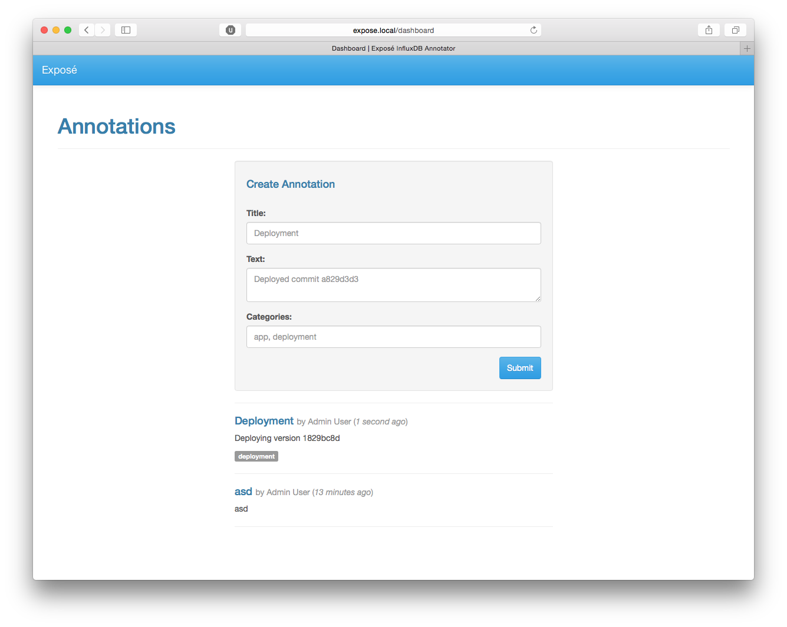

# Exposé Annotator

This is a nice little interface that provides a method for admins to have an API and an interface to create annotations
manually, as well as record deployments through the API as well.



## Installation

You must have a **MySQL** server, as well as an **InfluxDB** server. The
**[memecached](https://github.com/EvanDarwin/Memecached)** server is optional.

Clone the application into your desired directory, and go ahead and prepare the app:

```sh
composer install -o
npm install
gulp --production
cp .env.example .env
editor .env

php artisan migrate --force
```

And fill in the appropriate values.

## Default Login

The default login is `admin:admin`

## License

This is open-sourced software licensed under the [MIT license](http://opensource.org/licenses/MIT)
